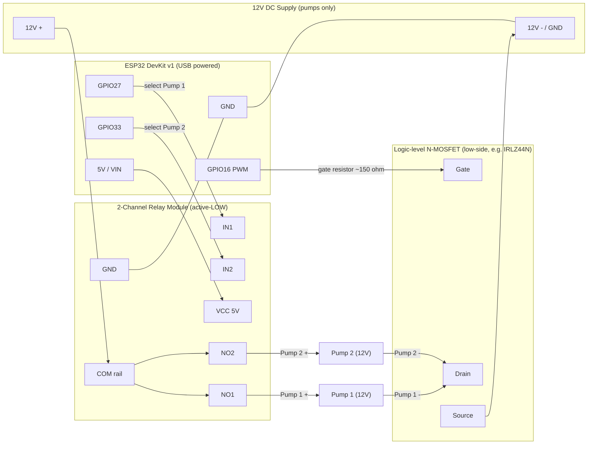

# IrrigaTOP — ESP32 Wiring Diagram

> Maintainable hardware reference. Edit the pin table and the Mermaid block
> below as the build changes — both are plain text and the diagram renders
> automatically on GitHub.

## Overview

An **ESP32 DevKit v1** controls two **12 V DC pumps**:

- Two **active-LOW** relay channels (one per pump) select **which** pump is
  energized (they switch the 12 V **+** line to each pump).
- One **logic-level N-channel MOSFET** on the shared low side (return) is driven
  by PWM from GPIO16 to set pump **speed/intensity** (0–100 % → 0–255 duty).
- The ESP32 is powered **separately** (USB / its own 5 V). The 12 V supply feeds
  only the pumps.

To run a pump: the relay for that pump closes **and** the MOSFET PWM duty is
above 0.

## ⚠️ Common ground (read this first)

Because the ESP32 and the 12 V pump supply are powered from **different**
sources, their grounds **must be connected together**:

```
ESP32 GND  ──┬──  12 V supply (−)  ──  MOSFET Source  ──  Relay module GND
```

Without this shared reference the relay inputs and the MOSFET gate have no
stable 0 V to switch against, and the system behaves unpredictably. This is the
most common wiring mistake for this topology.

## Pin assignment (from `src/main.cpp`)

| ESP32 GPIO | Code name      | Connects to            | Logic / notes                    |
|-----------:|----------------|------------------------|----------------------------------|
| 27         | `pump1Pin`     | Relay module **IN1**   | Drive **LOW** = Pump 1 ON         |
| 33         | `pump2Pin`     | Relay module **IN2**   | Drive **LOW** = Pump 2 ON         |
| 16         | `pwmPin`       | MOSFET **gate** (via resistor) | PWM 1 kHz, 0–255 duty = speed |
| 2          | `boardLedPin`  | Onboard LED            | Heartbeat blink (HIGH = on)      |
| 5V / VIN   | —              | Relay module **VCC**   | 5 V logic supply for the relays   |
| GND        | —              | Common ground rail     | See section above                 |

## Connection diagram



## Protection / supporting components (recommended)

These aren't GPIO connections but matter for a setup left running unattended:

- **Flyback (freewheeling) diode across each pump** — pumps are inductive
  motors; PWM switching produces voltage spikes that can destroy the MOSFET.
  Place a diode (e.g. **1N5819** Schottky, or 1N4007) across each pump with the
  **cathode (stripe) toward the 12 V +** side.
- **Gate resistor (~100–220 Ω)** in series between GPIO16 and the MOSFET gate —
  limits inrush to the gate.
- **Gate pull-down (~10 kΩ)** from gate to GND — keeps the pump OFF while the
  ESP32 boots and GPIO16 is floating.
- **Logic-level MOSFET** — must fully turn on at 3.3 V gate drive (e.g.
  **IRLZ44N**, **IRL540N**). A standard IRF540 will *not* fully turn on from a
  3.3 V GPIO.
- Size the MOSFET and 12 V supply current for **both pumps' stall current** with
  margin.

## To confirm / fill in (future me)

Replace these placeholders with your actual parts so this doc stays the source
of truth:

- [ ] MOSFET part number actually used: `__________`
- [ ] Flyback diode part: `__________`
- [ ] 12 V supply rating (A): `__________`
- [ ] Pump model + current draw (running / stall): `__________`
- [ ] Relay module model: `__________`
- [ ] How the ESP32 is mounted/powered in the enclosure: `__________`

## Firmware cross-reference

- Pump on/off + PULSE logic: `setPump()` in `src/main.cpp`.
- Speed/intensity → PWM duty: `set_pwm_intensity()` (scales 0–100 % to 0–255).
- Active pump selection: `set_pump_id()` (switches which relay pin is driven).
